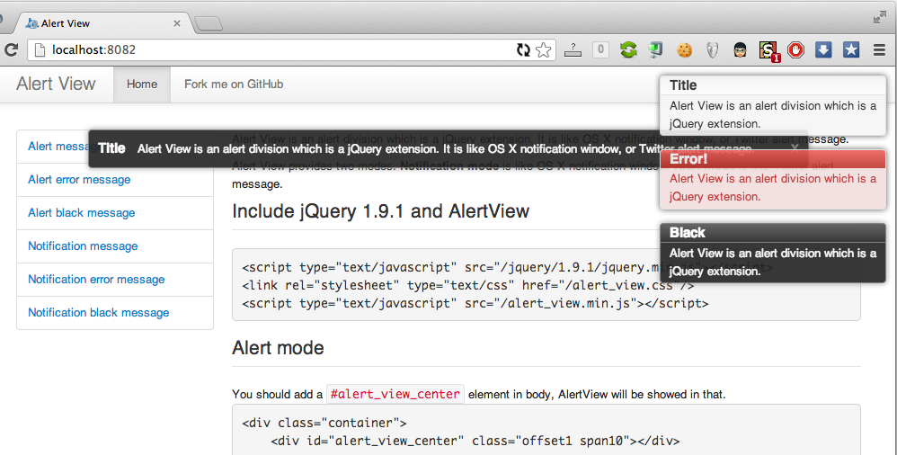

#AlertView [](https://david-dm.org/kelp404/AlertView#info=devDependencies)

Kelp https://twitter.com/kelp404  
[MIT License](http://www.opensource.org/licenses/mit-license.php)

```
         _    _           _    __     ___
        / \  | | ___ _ __| |_  \ \   / (_) _____      __
       / _ \ | |/ _ \ '__| __|  \ \ / /| |/ _ \ \ /\ / /
      / ___ \| |  __/ |  | |_    \ V / | |  __/\ V  V /
     /_/   \_\_|\___|_|   \__|    \_/  |_|\___| \_/\_/
```

AlertView is a jQuery plugin that provides alerting message. That are like OS X notification window, and Twitter alert message.  

AlertView provides two modes. `Notification mode` is like OS X notification window. `Alert mode` is like Twitter alert message.  
It provides three templates: `default`, `error` and `black`.  
Enjoy it :-)  


##Demo
http://kelp404.github.io/AlertView/  



##Include jQuery and AlertView
```html
<script type="text/javascript" src="https://ajax.googleapis.com/ajax/libs/jquery/2.0.3/jquery.min.js"></script>
<link rel="stylesheet" type="text/css" href="dist/alert_view.css"/>
<script type="text/javascript" src="dist/alert_view.min.js"></script>
```


##Functions
```javascript
// pop alert view
var id = $.av.pop({
    title: 'alert title',
    message: 'alert message',
    template: 'default/error/black',
    mode: 'notification/alert',
    expire: 5000   // AlertView will be closed after 5000ms
});

// close alert view
$.av.hide(id);
```


##Alert mode
You should add a `.alert_view_center` element in body, AlertView will be showed in that.
```html
<div class="container">
    <div class="alert_view_center offset1 span10"></div>
    ......
```
```javascript
$.av.pop({
    mode: 'alert',
    title: 'Title',
    message: 'Alert View is an alert division ....'
});

// black template
$.av.pop({
    mode: 'alert',
    template: 'black',
    title: 'Title',
    message: 'Alert View is an alert division ....'
});

// error template and not auto hide
$.av.pop({
    mode: 'alert',
    template: 'error',
    expire: 0,
    title: 'Title',
    message: 'Alert View is an alert division ....'
});
```


##Notification mode
```javascript
$.av.pop({
    title: 'Title',
    message: 'Alert View is an alert division ....'
});

// black template and hide after two seconds
$.av.pop({
    template: 'black',
    expire: 2000,
    title: 'Title',
    message: 'Alert View is an alert division ....'
});
```


##Close AlertView
```javascript
var aid = $.av.pop({
        title: 'Title',
        message: 'Alert View is an alert division ....'});
$.av.hide(aid);
```


##Development
```bash
# install node modules
$ npm install
```
```bash
# run the local server and the file watcher to compile CoffeeScript
$ grunt dev
```


###[Closure Compiler](https://code.google.com/p/closure-compiler/)
You could download compiler form [Google Code](https://code.google.com/p/closure-compiler/wiki/BinaryDownloads?tm=2).

**[External Tools](http://www.jetbrains.com/pycharm/webhelp/external-tools.html):**

Settings  |  value
:---------:|:---------:
Program | java
Parameters | -jar /Volumes/Data/tools/closure-compiler/compiler.jar --compilation_level SIMPLE_OPTIMIZATIONS --js $FileName$ --js_output_file $FileNameWithoutExtension$.min.$FileExt$
Working directory | $FileDir$
